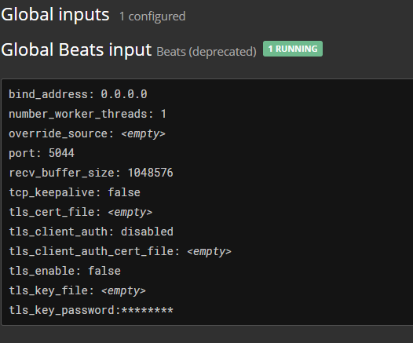

# Graylog for AMD64/ARM64 on Kubernetes

## Graylog install
Inspiring by [kongz/graylog](kongz/graylog) Helm chart for Graylog deployment on Kubernetes. We need to deploy an ElasticSearch instances (one [elastic.yaml](elastic.yaml) or cluster for HA), deploy a MongoDB instances (one [mongodb.yaml](mongodb.yaml) or cluster for HA) and finaly deploy a Graylog instances (one [deploy.yaml](deploy.yaml) or Cluster for HA also).


For Graylog cluster mode deployment, we need a service account [(@see RBAC file)](rbac.yaml) with graylog namespace scope to chose and set a master node [(@see deploy file)](deploy.yaml).


In all cases, we need to setup an admin account [(@see secret file)](secret.yaml.dist), by setting a a password (with SHA2-256 encode), and set up the TLS Secret for HTTPS Ingress of Graylog.

## Graylog Sidecar
To configure Graylog, we use a simple example app with a single pod [(@see app file)](app/app.yaml.dist) writing periodic log in Syslog format to `/log/app.log` file. To scrape the log file, we need to use shared volume between the application pod and the sidecar pod (can be an empty dir). We need to login into the Graylog instance as admin and generate an access token to our sidecare app. After that, we need to set up , the Graylog host, the generated api token and pick an unique sidecar ID in the environment section of the sidecar deployment. Next, go to configuration section.

## Graylog configuration
After app and sidecar deployment, we will see the sidecare running into Graylog web view :


Next, we need to go to manage sidecar, then select filebeat, then configure and chose `filebeat`, you can see collector configuration view and go to set up the log file path to be processed then the graylog input.


Next, we need to start the process of the collector, be checking the `filebeat` collector on sidecar page administration, click on process then start.


Finally, we need to set up an input on Graylog, so go to `inputs` view, select Beats input and create a new one.




That's it, you can now see the incoming messages on `search` view


---
## Tips
To build sidecar image, we can use the [source Dockerfile](sidecar/Dockerfile)  
```bash
docker buildx build --push --platform linux/arm64,linux/amd64 --tag medinvention/graylog-sidecar-filebeat:1.2.0 . -f Dockerfile 
```

---- 

[*More informations*](https://blog.medinvention.dev)